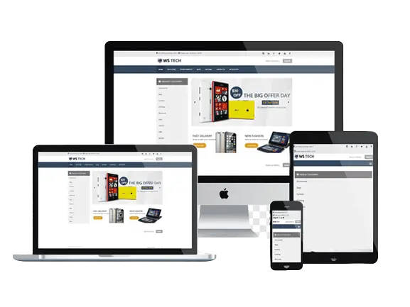

<h1 align="center">🔌 Landing Page - Eletricista ⚡</h1>

Construção de uma landing Page voltada para apresentação de algum negócio. O exemplo é de um profissional da área de elétrica. O projeto pode ser adaptado para outros seguimentos.

 
 <h2>🕹️ Tecnologias Utilizadas</h2>
    <ul align="center">
        
        
    </ul>

 

<h2 align="center">🤔 Como Utilizar</h2>
 
Com ajuda do mouse/teclado é possível navegar pela página e solicitar orçamento, verificar serviços e localização do profissional. Abaixo temos um pequeno gif com a apresentação do sistema:
 

<i>Gif - funcionalidades da página</i>

Gif - funcionalidades do sistema

<h2 align="center">*** Responsividade ***</h2>

O projeto apresenta responsividade na navegação nos principais dispositivos: 

<ul>
    <li>Desktop</li>
    <li>Tablet</li>
    <li>Smartphone</li>
</ul>

<h2 align="center">*** Link da página ***</h2>

Abaixo temos o link da página para visualização e testes:

🔗 <a href="https://oseiasweb.github.io/Landing-Page-Eletricista/" target="_blank">Landing Page - Eletricista</a> 

 
<h2 align="center">*** Status Projeto ***</h2>

